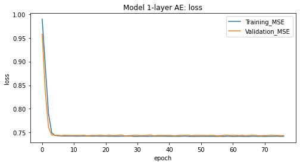
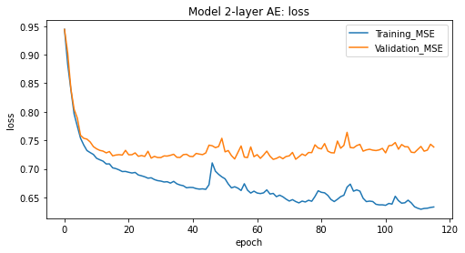
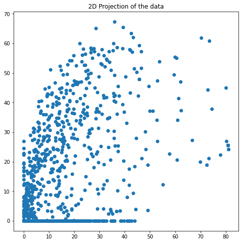
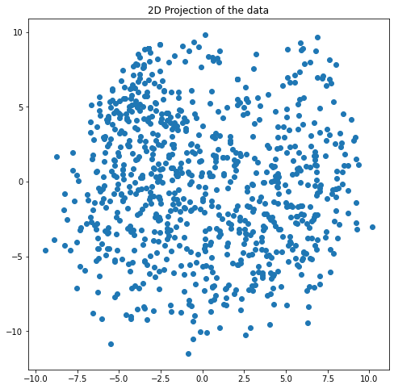

# Embedding Tool
> An embedding toolkit that can perform multiple embedding process which are low-dimensional embedding (dimension reduction), categorical variable embedding, and financial time-series embedding.


## Install

`pip install embedding-tool`

```python
from embedding_tool.core import *
```

## How to use

## Dimension Reduction: `dimensionReducer` class
> The function performs dimensionality reduction, pre-processing the data and comparing the reconstruction error via PCA and autoencoder.

**Input data:**
The input matrix has a size of 863 $\times$ 768.

```python
print ("Data's size: ", testing_data.shape)
```

    Data's size:  (863, 768)
    

**Performing dimension reduction:** we will reduce the number of dimension from 768 to 2. The learning rate of 0.002 will be use for the ADAM optimizer for the autoencoder model fitting.

```python
dim_reducer = dimensionReducer(testing_data, 2, 0.002)
dim_reducer.fit()
```

**Calculating the MSE of the reconstructed vectors**

```python
dim_reducer.rmse_result
```


<div>
<style scoped>
    .dataframe tbody tr th:only-of-type {
        vertical-align: middle;
    }

    .dataframe tbody tr th {
        vertical-align: top;
    }

    .dataframe thead th {
        text-align: right;
    }
</style>
<table border="1" class="dataframe">
  <thead>
    <tr style="text-align: right;">
      <th></th>
      <th>PCA</th>
      <th>1AE</th>
      <th>2AE</th>
    </tr>
  </thead>
  <tbody>
    <tr>
      <th>MSE</th>
      <td>0.740122</td>
      <td>0.741265</td>
      <td>0.65168</td>
    </tr>
  </tbody>
</table>
</div>


Here we can see that the two-layers autoencoder has the best performance with the lowest MSE of 0.64.

**Observing the loss thorughout the epoch:** If we see that the MSE doesn't converge fast enough, we could adjust the learning rate parameter. The default is 0.002. Try increase it to 0.005 if it doesn't converge or decrease to 0.001 if it converges way too fast and oscillating.

```python
dim_reducer.plot_autoencoder_performance()
```








**Reduced Dimension Output:** There are three outputs from three different methods, which are PCA, 1-layer AE, and 2-layers AE.

```python
dim_reducer.dfLowDimPCA.head()
```


<div>
<style scoped>
    .dataframe tbody tr th:only-of-type {
        vertical-align: middle;
    }

    .dataframe tbody tr th {
        vertical-align: top;
    }

    .dataframe thead th {
        text-align: right;
    }
</style>
<table border="1" class="dataframe">
  <thead>
    <tr style="text-align: right;">
      <th></th>
      <th>0</th>
      <th>1</th>
    </tr>
  </thead>
  <tbody>
    <tr>
      <th>0</th>
      <td>-16.078718</td>
      <td>-6.701481</td>
    </tr>
    <tr>
      <th>1</th>
      <td>-8.858150</td>
      <td>9.354204</td>
    </tr>
    <tr>
      <th>2</th>
      <td>4.305739</td>
      <td>-0.464707</td>
    </tr>
    <tr>
      <th>3</th>
      <td>-11.514311</td>
      <td>-0.687461</td>
    </tr>
    <tr>
      <th>4</th>
      <td>1.212006</td>
      <td>6.537965</td>
    </tr>
  </tbody>
</table>
</div>


```python
dim_reducer.dfLowDim1AE.head()
```


<div>
<style scoped>
    .dataframe tbody tr th:only-of-type {
        vertical-align: middle;
    }

    .dataframe tbody tr th {
        vertical-align: top;
    }

    .dataframe thead th {
        text-align: right;
    }
</style>
<table border="1" class="dataframe">
  <thead>
    <tr style="text-align: right;">
      <th></th>
      <th>0</th>
      <th>1</th>
    </tr>
  </thead>
  <tbody>
    <tr>
      <th>0</th>
      <td>-6.178097</td>
      <td>4.734626</td>
    </tr>
    <tr>
      <th>1</th>
      <td>2.075333</td>
      <td>5.529111</td>
    </tr>
    <tr>
      <th>2</th>
      <td>0.953502</td>
      <td>-1.667776</td>
    </tr>
    <tr>
      <th>3</th>
      <td>-2.488155</td>
      <td>4.001960</td>
    </tr>
    <tr>
      <th>4</th>
      <td>3.183654</td>
      <td>0.589496</td>
    </tr>
  </tbody>
</table>
</div>


```python
dim_reducer.dfLowDim2AE.head()
```


<div>
<style scoped>
    .dataframe tbody tr th:only-of-type {
        vertical-align: middle;
    }

    .dataframe tbody tr th {
        vertical-align: top;
    }

    .dataframe thead th {
        text-align: right;
    }
</style>
<table border="1" class="dataframe">
  <thead>
    <tr style="text-align: right;">
      <th></th>
      <th>0</th>
      <th>1</th>
    </tr>
  </thead>
  <tbody>
    <tr>
      <th>0</th>
      <td>32.622066</td>
      <td>54.652271</td>
    </tr>
    <tr>
      <th>1</th>
      <td>35.649811</td>
      <td>40.493984</td>
    </tr>
    <tr>
      <th>2</th>
      <td>15.314294</td>
      <td>5.869064</td>
    </tr>
    <tr>
      <th>3</th>
      <td>19.667603</td>
      <td>37.821194</td>
    </tr>
    <tr>
      <th>4</th>
      <td>36.183212</td>
      <td>25.429262</td>
    </tr>
  </tbody>
</table>
</div>


**Plotting the embedding (for 2-dimensional embedding)**

```python
plot_output(dim_reducer.dfLowDim2AE)
```





```python
plot_output(dim_reducer.dfLowDim1AE)
```





***

# Reference: 
- https://towardsdatascience.com/dimensionality-reduction-pca-versus-autoencoders-338fcaf3297d
- https://towardsdatascience.com/autoencoders-vs-pca-when-to-use-which-73de063f5d7

***
